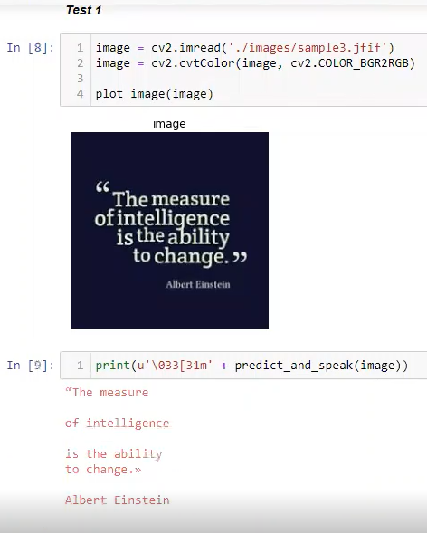

# CV-Bootcamp-Project
4W's Problem statement for the project:

| . | statement | W |
| :-- | :----------------------- | :---|
| Our | Visually impaired people | Who |
| Has / have a problem that |	They are unable to read | What |
| when / while | There is a need to read a document or text | Where |
| An ideal solution would | Be a CV based text dictator | Why |

## CV based Text Reader
CV bassed Text Reader reads aloud the text from the image 

### Summary:
> This app extracts the text form the images provided and reads the text aloud so that the visually impaired people can use this to read the documents.

### Dependencies:
- `pytesseract`
- `pyttsx3`
- [tesseract-orc](https://tesseract-ocr.github.io/tessdoc/Home.html#binaries)

## Demo:

